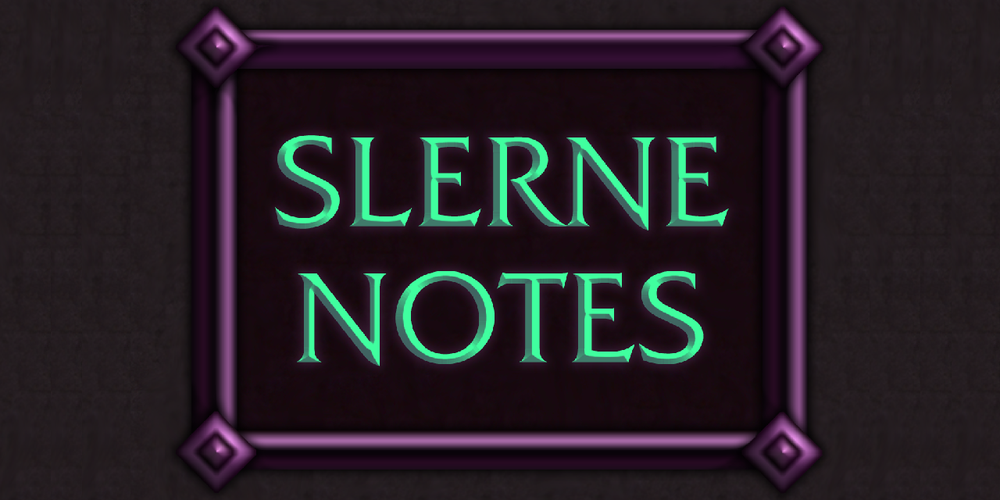

# Slerne Notes

  

Raid assignment planner for World of Warcraft (Retail). Build a plan by dragging
raid members into modules, drawing on a shared canvas, and broadcasting the
result to your group.

A read-only companion, Slerne Notes Viewer, lets members receive and view a plan
without running the full addon.

Parts of this addon were developed with AI assistance.

## Installation

Copy the `SlerneNotes` folder into `World of Warcraft/_retail_/Interface/AddOns/`,
then enable it on the character select addon list.

## Usage

Open the window with `/sn` or the minimap button.

- Create a canvas per boss, with up to eight pages inside each.
- Add modules (Assignment, List, Action List, Image, Flipbook, Text Block) and drag players onto them.
- Draw lines, shapes, raid markers, and class or role icons on the canvas.
- Press Send to Group to broadcast the full canvas, including every page, to your party, raid, or instance group.
- Press **S** on a List module to sort your raid subgroups to match it.
- Archive canvases you are done with. They move into an Archive folder in the canvas dropdown instead of cluttering the list.

## Custom art

Two folders are yours to fill, and both are ignored by git:

- `img/maps/custom/` takes your own arena images as uncompressed 24 or 32 bit TGA files. They appear in the Image module picker.
- `img/flipbooks/custom/` takes animated sheets as PNG files. A sheet is one image holding every frame in a grid, read left to right and top to bottom. In the Flipbook module, type the file name and set rows, columns, frames and FPS.

Anyone receiving a plan needs the same custom file in their own folder for it to display, exactly as with custom maps.

## License

Source code is released under the MIT License. See [LICENSE](LICENSE).

The MIT License covers the code only. It does not cover the image assets:

- World of Warcraft icons and map textures are property of Blizzard Entertainment. They are used in line with Blizzard's addon policy. This addon is free and non-commercial.
- Custom art in `img/` was commissioned from Tado and Taco and remains their property. It is included here with permission and is not licensed for reuse.

## Credits

- Custom art by Tado: https://instagram.com/tadogram
- Secret easter egg art by Taco
- Bundled libraries: LibStub, CallbackHandler-1.0, LibDataBroker-1.1, and LibDBIcon-1.0, each under its own license.
